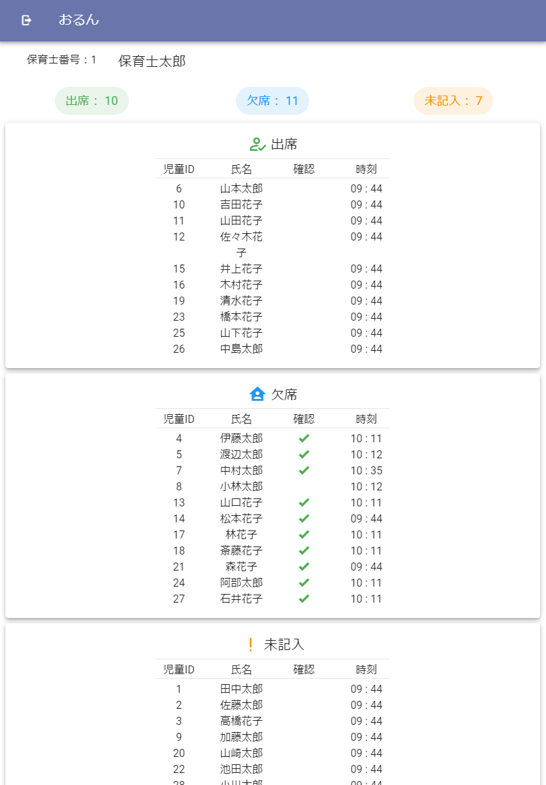

# 児童出欠管理アプリ「おるん」

## デモのURL
https://posaune410.github.io/

## 環境・ライブラリ
- Python: 3.10
- Django: 4.0.6
- Node.js: v18.17.1
- Vue.js: 3.3.4
- Vuetify: 3.3.15

## システム概要
- 幼稚園や保育園での、児童の出欠管理を行うための簡易的なwebアプリケーションです。
- 保育士は、児童一覧から保護者によって登録された児童の出欠情報を確認することができます。
- 保育士は児童の出欠登録を確認し、欠席の場合には確認ボタンを押すことで保護者に確認された旨が送信されます。

## アプリの使い方
### 保護者モード
1. id を入力し、「ログイン」ボタンを押します（このデモでは id を 1 ~ 30 の任意の整数にしてください。）
2. 登録状況表示ページに遷移したら、「出欠入力」ボタンを押します
3. 出欠入力フォームページに遷移するので、出欠や欠席理由を入力し、送信ボタンを押します。
4. 再び登録状況表示ページに遷移し、先程送信した登録状況が反映されます。
5. 左上のログアウトボタンを押すことで最初の画面に戻れます。
### 保育士モード
1. 右上のタブより「保育士モード」を選択します。
2. id を入力し、「ログイン」ボタンを押します（このデモでは id を 1 ~ 3 の任意の整数にしてください。）
3. 以下のような児童一覧画面に遷移します。欠席児童をクリック（タップ）し、詳細を確認してください。
4. 欠席児童の詳細画面にある「確認」ボタンによって保護者に確認したことを知らせることができます。

## バックエンドのリポジトリ
https://github.com/posaune410/DjangaoAppServer_1